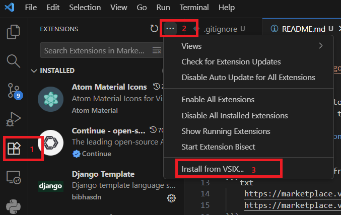
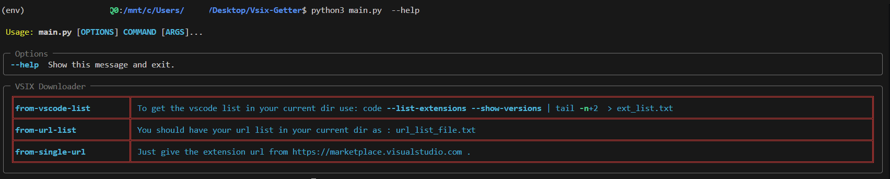

<p align=center>
    
<p>

- This is a simple CLI tool to get your VsCode VSIX files extension : 

## 1\ From your current VsCode :

- You can download from the extract list of your current vscode  : 
```bash
    code --list-extensions --show-versions | tail -n+2  > ext_list.txt
```
- output exemple : 

```bash
    ms-python.debugpy@2025.14.1
    ms-python.python@2025.16.0
    ms-python.vscode-pylance@2025.9.1
    ms-python.vscode-python-envs@1.10.0
```

## 2\ From a url list : 

- You can download from a list you've made and named `url_list_file.txt` : 
```txt
    https://marketplace.visualstudio.com/items?itemName=ms-python.pylint
    https://marketplace.visualstudio.com/items?itemName=fnando.linter
```

## 3\ From a single url :
- Finally you can download a single extension direclty from maketplace url 


*Every download is stored in your current dir under `VSIX-DL/` dir*

____________

- You can then install you favorite plugin :

<p align=center>
    
</p>


____________

- You can look at the help menu : 

<p align=center>
    
</p>

*look into the .txt on the repo ton find format list exemple.*

____________


